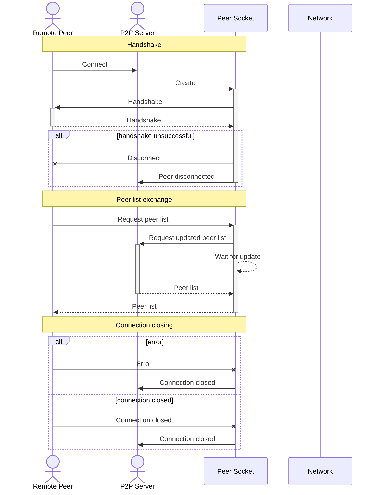
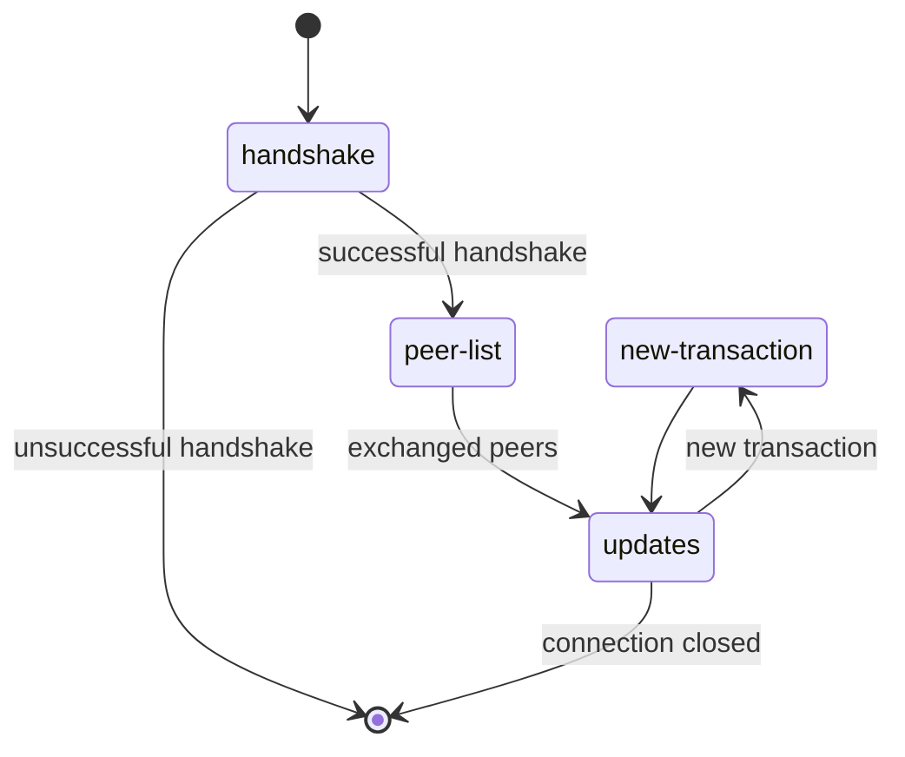

# About

> **HEY! THIS A RESEARCH PROJECT! DON'T USE THIS!1!!**
>
> At the moment it is very broken (Individual components are (roughly) working but they need to be integrated). 
>
> Even when working, it is not expected to be production grade.
>
> Do not use this for any serious application!

**TOC**

- Overview
- Quickstart
- Visiona and Roadmap
- Roadmap
- Modules

## Overview

**Enable open, auditable and distributed computing**

Topic-based, blockchain with Smart Contracts. Platform to test consent mechanisms. Written in Typescript.

## Quick start

Start with `npm run start`

Or, in dev mode `npm run dev`

For tests, `npm run {tests}`
- All tests: `test`
- All tests + coverage report: `test:coverage`
- Only current tests: `test:current` (marked with @current)
- Only unit tests: `test:unit` (marked with @unit)
- Only integration tests: `test:integration` (marked with @integration)
- Only e2e tests: `test:e2e` (marked with @e2e)

For docs, `npm run {docs}`
- All docs: `docs`
- REST api documentaion: `docs:api`
- UML diagram: `docs:uml`

For reports: `npm run {report}
- All reports: `report`
- Count lines of code: `report:count-lines` (note: runs Shell script)
- Linter (eslint): `report:eslint` (note: run Shell script)
- Liscences: `report:liscences`

## Vision and Roadmap

**Enable open, auditable and distributed computing**

The blockchain is an amazing concept which uses market forces to create distributed authority. The main mechanism used to achieve this (the mining or minting or new blocks) is, however, its main limitation which severely impacts throughput.

As businesses see increasing value in distributed and auditable computing there are opportunities for rethinking some of blockchains limitations, try other consent mechanisms and see how to integrate blockchains in other contexts.

This project aims to:

- Understand how a functional blockchain works
- Test the viability of typescript to create high performance blockchains
- Try multiple consent mechanisms
- Attempt to create a topic-based blockchain to increase throughput

### Roadmap

**Done**

- Cryptografically signed objects and auditing
- Transactions, Actors and Blockchain 

**Now**

- Integrate modules
- Proof of stake minting

**Next**

- Better testing
- Smart contracts

**Later**

- Blockchain "topics"

## Modules

The system is composed of individual modules, connected through a "node"

### REST - REST server for interacting with platform

Simple REST server that allows clients to create and manage orders in the blockchain.

Endpoints are anotated with Apidoc and documentation can be generated with `npm run docs:api`.

### P2P - Peer 2 Peer Communication

Inter-node communication built on top of TCP.

**Sequence diagram**

**State diagram**

